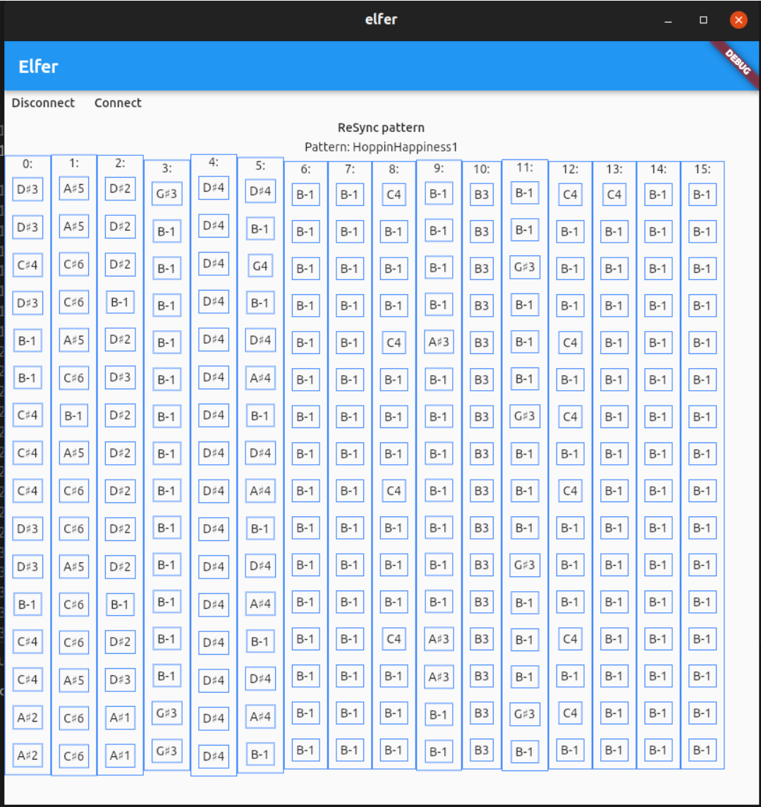

# elfer

A pattern editor, in the "style" of a Tracker, for the Korg Electribe 2's (synth, sampler, hacktribe).

## Status

This is very much a WORK-IN-PROGRESS, not too much works right now, except for reading a pattern in from the E2.



### Features

* [x] Display partial pattern in tracker UI
* [x] Switch patterns in tracker UI using E2 dial
* [ ] Display full pattern (all 64 steps) 
* [ ] Edit pattern notes in tracker UI using E2 controls
* [ ] Send edited pattern back to E2
* [ ] Edit pattern parts, osc, ifx etc in Tracker UI
* [ ] Edit instrument patchs (samples?) in Tracker UI
* [ ] Playback pattern(s) from Tracker state (without sending to E2)
* more?


## Getting Started

I'm currently developing with Flutter master channel.

It works on Linux, should also work on Web. 

Android support coming soon.

### Running on Web

Run in non-Chrome browser, ie. Firefox using: `flutter run -d web-server`


## Debugging

### Linux

To check midi incoming via cli.

To  list ports:
```
> aseqdump -l # will list ports
Port    Client name                      Port name
  0:0    System                           Timer
  0:1    System                           Announce
 14:0    Midi Through                     Midi Through Port-0
 32:0    electribe2 sampler               electribe2 sampler electribe2 s
```

To see incoming messages (using above port number):
```
aseqdump -p 32:0
```

Audio output on oscilloscope:
```
padsp xoscope
```