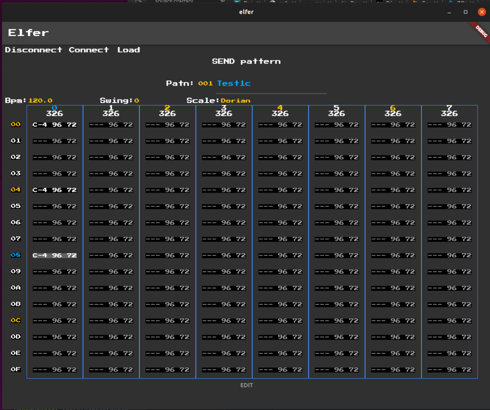

# elfer

A pattern editor, in the "style" of a Tracker, for the Korg Electribe 2's (synth, sampler, hacktribe).

## Status

This is very much a WORK-IN-PROGRESS, not too much works right now, except for reading a pattern in from the E2.



### Features

* [x] Display partial pattern in tracker UI
* [x] Switch patterns in tracker UI using E2 dial
* [x] Display full pattern (all 64 steps) 
* [x] Edit pattern notes in tracker UI using keyboard
* [x] Edit pattern notes in tracker UI using E2 controls (Hacktribe only)
* [x] Send edited pattern back to E2
* [x] Stash/Load current pattern with app
* [x] display step on/off, velocity & gate in tracker UI
* [X] Send pattern to E2 current pattern, not save to pattern slot on E2
* [ ] Button to reload current pattern from E2 
* [ ] load blank init pattern
* [ ] save/load patterns to local files
* [ ] export/import other file formats, eg. Sunvox
* [ ] Edit step on-off, velocity & gate in tracker UI
* [ ] Edit pattern parts, osc, ifx etc in Tracker UI
* [ ] Edit instrument patchs in Tracker UI
* [ ] read/write e2 all-samples file
* [ ] sample editor
* [ ] load/send samples to E2, once [hacktribe supports this over Sysex](https://github.com/bangcorrupt/hacktribe/discussions/65)
* [ ] Playback pattern(s) from Tracker state (without sending to E2)
* more?

## Getting Started

I'm currently developing with Flutter beta channel.

Currently only works on **Linux** and **Android**.

Web and MacOS support maybe added in the future.

## Usage

Currently Elfer is still very much Work-in-Progress and only suitable to use by advanced/brave users.

* Connect E2 via USB to device running Elfer.
* Start Elfer
* Press `Connect` button in Elfer
* It will take a few seconds for Pattern1 to load and display on Elfers Tracker Grid UI
* Navigate the Tracker grid either via keyboard on device running Elfer or E2 panel controls - see below
* Press `Send TO E2` button to send changes to E2
* For now loading changes from E2 to Elfer requires saving pattern on E2 then switch to another pattern, then back again
* have fun!

### Keyboard controls

* Arrow keys to navigate grid
* TAB to switch between grid and other UI controls

### Panel Controls

_NOTE_: Using the E2's panel controls to navigate Elfer is **ONLY** possible when using the [Hacktribe](https://github.com/bangcorrupt/hacktribe) firmware.

**!!IMPORTANT!!**

**Make sure you have your E2 Global Parameter settings (18/20) `PTN. CHANGE LOCK` sete to `On`.**
This is **VITAL** because Elfer uses the Select/Value knob to move between steps in a part and later on for other edit features, so if you don't have it set to On it will change between patterns on the E2 when you use it!

**!!IMPORTANT!!**

* Select (aka Value) knob to move between steps in a part
* Part buttons to move between parts
* Keyboard Mode: then use pads to enter a new note for currently selected step (currently only edit first note only)
* In Trigger Mode: the Buttons 1-4 will jump the grid to the matching section of steps, as happens on the E2 in StepEdit.

### Touch Controls

One of the key points to Elfer is to make editing patterns on the E2 **more** efficient than the built-in StepEdit function on the E2, so there is not really any point in using touch controls on eg. Android devices so only touch controls are for basic, infrequently used operations: Connect/Disconnect, File Load/Save, Title edit, etc.


## Debugging

### Linux

_NOTE:_ When developing on Linux, you need to disconnect prior to doing a hot-restart, otehrwise the Midi connection will lock up.

----

To check midi incoming via cli.

To  list ports:
```
> aseqdump -l # will list ports
Port    Client name                      Port name
  0:0    System                           Timer
  0:1    System                           Announce
 14:0    Midi Through                     Midi Through Port-0
 32:0    electribe2 sampler               electribe2 sampler electribe2 s
```

To see incoming messages (using above port number):
```
aseqdump -p 32:0
```

Audio output on oscilloscope:
```
padsp xoscope
```
